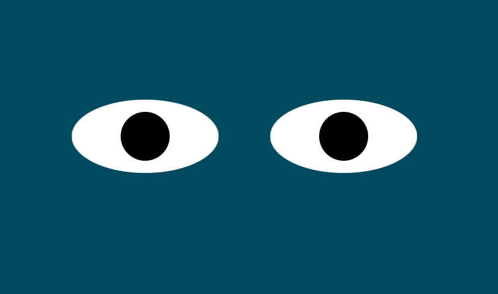

#Eyes Excercise
 

 
#Description
In this project I learned a bit about JS and how to connect it with HTML and CSS.
 
This project also opened my mind more about transforming in CSS.
 
#How To Run
After loading you would run your mouse cursor across the screen and watch the eyes 
 
follow your movments around the screen.
 
#Roadmap
I plan on adding more styles to this project and also using the technique in other projects
 
that I would like to be interactive. 
